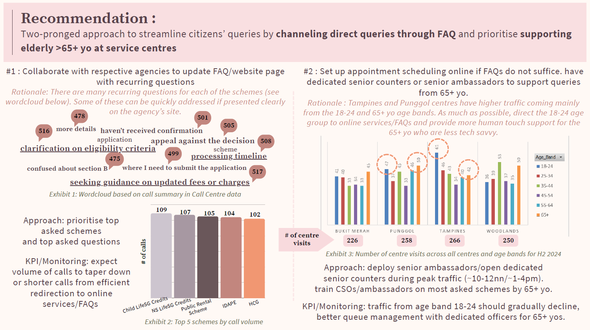

## Hi there, I'm Zawanah 👋

I'm an accountant turned analyst and now, tech enthusiast👩🏼‍💻. I thrive on the autonomy of exploring new tools, new ways of working and leveraging them to design✍🏼 and build solutions  that make our lives easier. I enjoy being part of an uplifting community of lifelong learners🤓 which led me to discover (and volunteer with) [Women Devs SG](https://linktr.ee/womendevssg), a community with a mission to create spaces for women to thrive in their technical careers🫱🏻‍🫲🏼. I value different perspectives so I enjoy listening to podcasts📻 and watching sci-fi/fantasy shows📺 that leave you inspired to build a better future🌱. I stay active so I cycle🚲 and run👟.

<!--- ### Peep some things I did  

*Designed AI-assisted grant disbursement review workflow with AntiGravity IDE*

*Recommended two-pronged approach to improve service delivery using call-centre and service-centre-visits data*
--->

### Tool stack
                           

### Reach Me @

<!--
### Reads / Insights -->

<!--START_SECTION:activity-->

